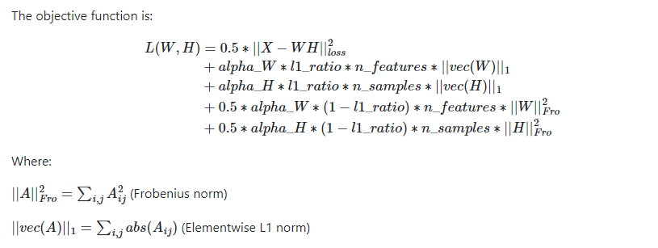
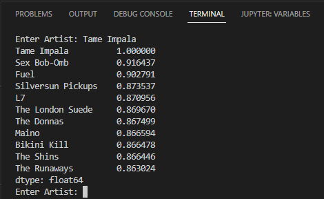
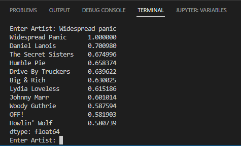
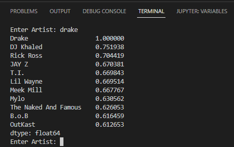
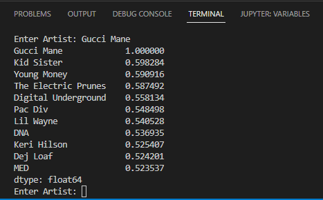
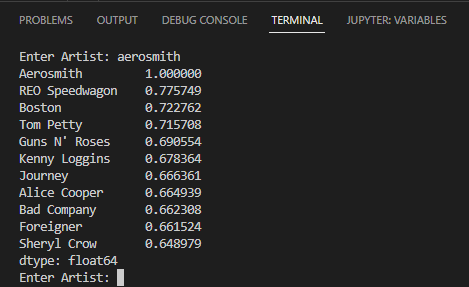

# NMF-Recommendation-System
## How Spotify Uses Decomposition Algorithms for Song Recommendations
NMF is a dimensional reduction method and effective for document/feature clustering, because a term-document matrix is high-dimensional and sparse. 
The initial matrix of the NMF algorithm is regarded as a clustering result. The trained model contains 7703 artists and 1121 users. Training the model took 40 minutes on 8 CPU cores clocking an average of 4.20GHz. Spotify and Apple Music both use the concept of collaborative filtering to recommend you artist and songs that are based on users with a similar listening history as you. Other companies use these recomendation systems as well, such as Amazon, Walmart, and really any business partaking in e-commerce. Recomendation systems are what is used under the hood of your customer/user experiance when you are checking out on Amazon and you see the pop-up of more products with the caption "Other users who purchased X also purchased Y, would you like to add Y to your cart?". This project uses the algorithm Non-Negative Matrix Factorization (NMF).
  

  
### Libraries Utilized
- Scikit-learn: pip3 install scikit-learn
- Pandas: pip3 install pandas
- Numpy: pip3 install pandas
- Multiprocessing: pip3 install multiprocessing
  
### Workflow  
1. *Spotify API calls* (gathering data)
2. reducing-user-load.py (cleaning data)
3. trying-to-sparse.ipynb (cleaning data)
4. Spotify_pivot_windows.ipynb / artist-cleaning.ipynb (cleaning data)
5. *Modeling*
6. jupyter-metric-testing.ipynb (testing)
7. nmf-quick-run.py (visualizing and testing interface)
8. talon-nmf-sparse91.py / nmf-run-sparse911.sh (Scaling the model for HPC cluster)
9. Iterative process of re-cleaning, re-defining model, hyperprameter tuning. testing, etc.

  
### How To Use
I have included the trained model for demonstration purposes, if you would like the raw data in order to follow along 
with my cleaning and wrangling process, please reach out to me and I would be glad to distribute that. The data comes from Spotify's API, my raw data contains over 2.3 billion observations by 4 features, so naturally it is a huge file that can not be uploaded to GitHub (file is a 1.2Gb CSV file). 
  
("nmf-quick-run.py" is the recommended method)  
To use it, open one of the 3 files listed below:  
- "Spotify_NMF_Final.ipynb"
- "NMF_Music_Artist_Recomend_Sys_R_Conversion.R"
- "nmf-quick-run.py"  
 
Then run the cell, line, or script which loads the model. Lastly select the artist of your choosing.
Please reach out for any further inquiries. 

### Examples

---
## IMPORTANT UPDATES (4/29/2023)
- Trained a more advanced iter (sparse10) on a super computer cluster
- Sparse10 now preserves all users for better results during decomposition
- Fixed time complexity issue, reason: setting components to features was incorrect. I needed to set the components to a "cluster" amount of sorts, similar to k-means. Before I was setting the components to the count of users, algorithm was not decomposing properly as a result of this.
- Included more files to the repository (files that are current and support the updated fixes, main cleaning file is now "artist-cleaning.ipynb", main HPC cluster files are "talon-nmf-sparse91.py" and "nmf-run-sparse911.sh", NMF testing is now "jupyter-metric-testing.ipynb", and misc.).
- Fixed awful compression size of the data and recomendation system, solution: clean the data more efficiently, and properly allocate the "n_components=" arg. You will notice that the files uploaded are no longer the sizes that I claim in the briefing which is great.
- Utilized regularization for smoother and more familiar recomendations, regularization was applied to the components (columns). Meaning that the algorithm was tuned to be more selective about what artist are considered in each of the components.
- Cleaned the input data in a more detailed mannor than previously done. In such a way that I was able to avoid compromising the number of users. Overall, I refined the artist by Regex, NLP, and statistics, and the users were left untouched as the only reason they were being pruned before was due to the time complexity of the model, however this was resolved.
- Added a seed for reproducible results (not sure why I didn't do that before?).
- Included the semi-processed uncleaned file into this repository, noted as "spotify-compressed.csv".
  
The new iter was trained on **Georgia Southern Universities** HPC super computer cluster using 32-cores with 4G of RAM allocated to each core, timing around 6-8mins to train the model. The most up-to-date version of the recommendation system is to run "sparse10-trained.csv". Overall, the NMF recomendation system is still a work in progress and it is also important to keep in mind that there may be much better models to use rather than NMF, I would almost say that I am sure that there are better models to use, however this project provides a variation of a Recommendation System. Lastly, I find this project to be very much a personal accomplishment, as I believe that the algorithm NMF was pushed above it's normal utility/limits. In general Non-negative Matrix Factorization is mostly used for image processing, where it is deployed for edge-detection, feature selection, object-detection, and item segmentation. 
